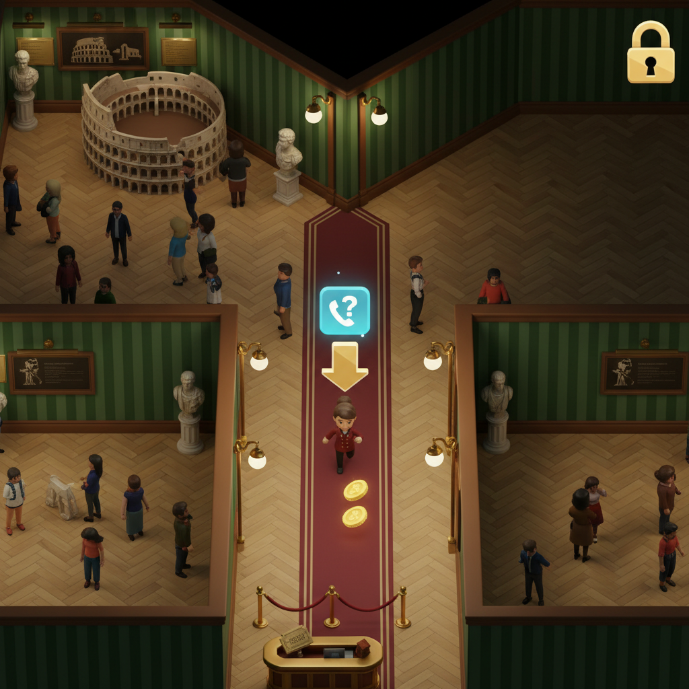
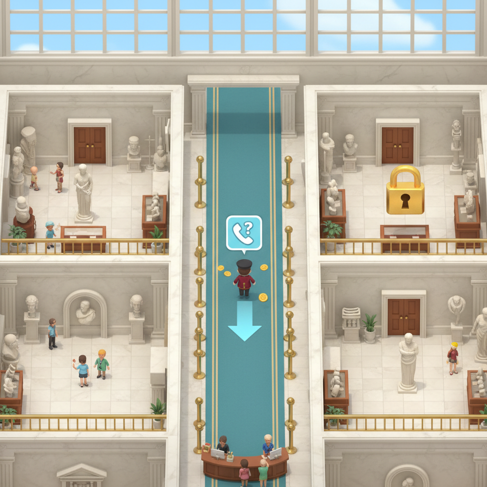
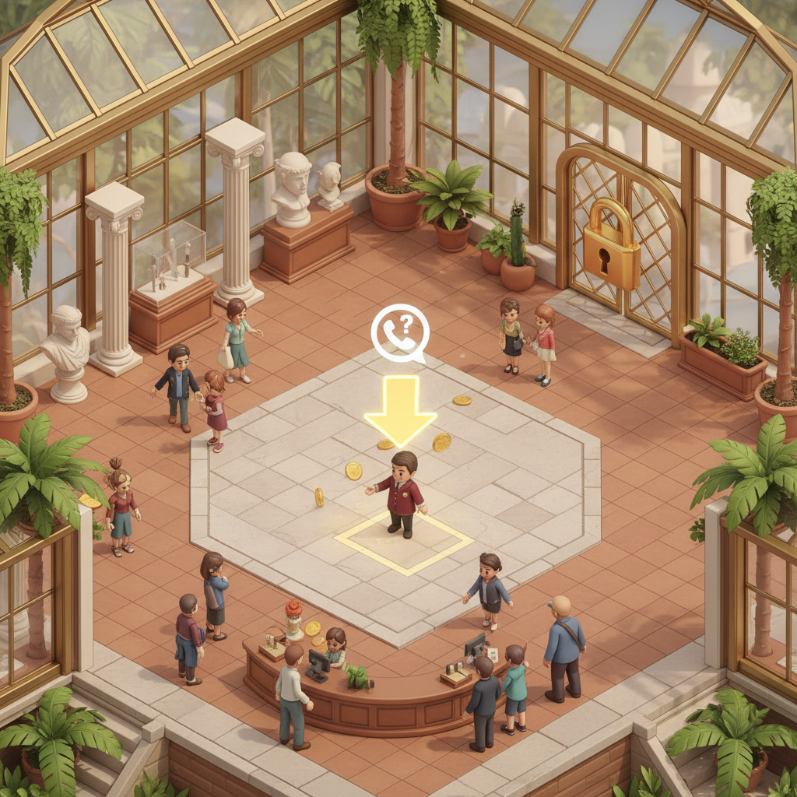

# The Curiosity Institute

The Curiosity Institute is a casual museum management game built around direct avatar control.

The player is the curator: a small on-floor character moving through the museum in real time, collecting coin pickups, responding to visitors, opening rooms, and handling live public-question events.

## Core Fantasy

The game should feel like:

- running a cozy museum with the readability of a premium mobile tycoon game
- physically moving the curator through the space instead of only tapping menus
- watching visitors flow through rooms while the museum grows wing by wing
- making the museum feel intelligent and alive through questions, reviews, and guided expansion

## Main Gameplay Loop

1. Guide the curator through the museum floor in a top-down 3D view.
2. Collect ticket income and exhibit income as coins pop into the world.
3. Watch tourists enter rooms, gather around highlights, and reveal demand.
4. Unlock and expand new rooms over time.
5. React to live events, especially Call the Curator questions from the public.

## Additional Gameplay: Call The Curator

During normal play, the curator can receive incoming public questions inspired by the British Museum's History Hotline concept.

That means:

- a live call event can appear while the player is already managing the floor
- the caller is a member of the public asking a history or museum-related question
- the event should feel like part of the museum fantasy, not a detached quiz menu
- good answers can improve reputation, curiosity, or demand for specific exhibition branches

Visually, the mechanic is represented in the gameplay concepts as a handset icon with a question mark above the curator.

## Three Main 3D Gameplay Directions

These three concept images show the same gameplay idea with clearly different visual languages:

- portrait mobile framing
- direct control of the curator
- floating coin pickups
- active exhibit or public room space
- visible locked future expansion
- incoming public-question call event

### Direction 1: Heritage Hall

- dark green striped walls
- pale parquet floors
- burgundy runner
- brass lamps and trim
- warm heritage-museum atmosphere



### Direction 2: Marble Atrium

- white stone and marble architecture
- skylit upper structure
- teal runner
- brighter daylight mood
- formal institutional feeling



### Direction 3: Glasshouse Museum

- brass-framed glass partitions
- terracotta and pale stone flooring
- indoor plants and warm daylight
- softer modern museum mood
- central rotunda hub instead of a straight corridor



## 3D Render Pipeline

This repo also contains a runnable Node pipeline that takes the tracked concept art in `docs/concept-art/`, sends each piece to a Google Gemini image model, and produces three distinct oblique 3D-map-style directions per source image.

What it does:

- reads all concept-art images under `docs/concept-art/`
- generates exactly three directional outputs per image:
  - `northwest-oblique`
  - `northeast-oblique`
  - `southwest-oblique`
- retries failed generations up to three times
- writes every failed attempt to `output/reports/attempt-failures.json`
- deduplicates repeated final failures in `output/reports/deduplicated-failures.json`
- saves per-render metadata next to each generated image

### Model Choice

The default model is `gemini-3-pro-image-preview`. You can override it with `GEMINI_MODEL` or `GOOGLE_IMAGE_MODEL`.

Supported auth modes:

- Gemini Developer API with `GEMINI_API_KEY`
- Vertex AI REST with `GOOGLE_ACCESS_TOKEN`, `GOOGLE_CLOUD_PROJECT`, and `GOOGLE_CLOUD_LOCATION`

### Usage

1. Copy `.env.example` to `.env`.
2. Set your Google credentials.
3. Run `npm run render`.

For a no-network pipeline pass that preserves directory layout and writes placeholder outputs:

```bash
npm run render:dry
```

### Output Layout

- `output/renders/<concept-art-relative-path>/<direction>.<ext>`
- `output/renders/<concept-art-relative-path>/<direction>.json`
- `output/reports/run-summary.json`
- `output/reports/attempt-failures.json`
- `output/reports/deduplicated-failures.json`
- `output/reports/deduplicated-failures.md`

## Files

Main gameplay directions live in:

- `docs/concept-art/gameplay-directions/direction-1-heritage-hall.png`
- `docs/concept-art/gameplay-directions/direction-2-marble-atrium.png`
- `docs/concept-art/gameplay-directions/direction-3-glasshouse-museum.png`

Pipeline entrypoint:

- `scripts/render-concept-art-3d.js`
